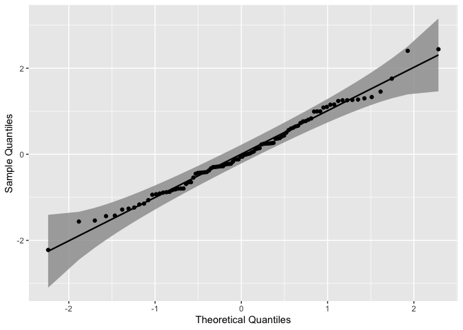
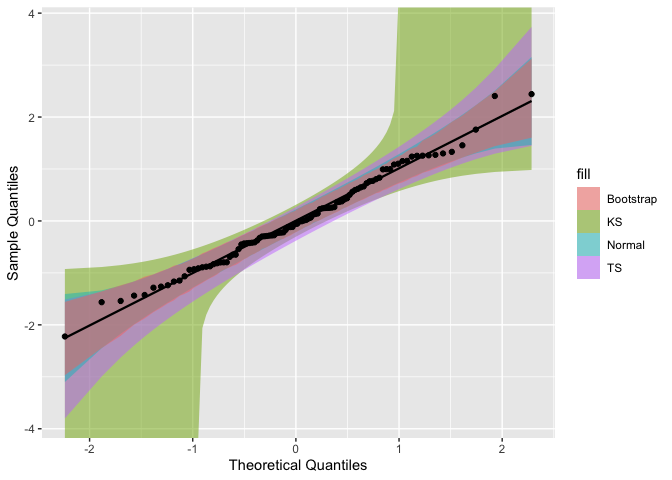

<!-- README.md is generated from README.Rmd. Please edit that file -->
qqplotr
=======

[](https://travis-ci.org/aloy/qqplotr)

Overview
--------

This package extends the functionality of `ggplot2` quantile-quantile (Q-Q) plots by permitting drawing Q-Q lines, confidence bands, and also a detrend option (Thode, 2002).

Development Version
-------------------

If you would like to download the development version of `qqplotr`, you may do so by using, for example, `devtools`:

``` r
# install.packages("devtools")
library(devtools)
install_github("aloy/qqplotr")
```

Details
-------

The following Stats are available in this package:

-   `stat_qq_point` Which is a modified version of `ggplot2::stat_qq` with some parameters adjustments and a new option to detrend the points.
-   `stat_qq_line` Plots a reference line based on the first and third quartiles of the data (as in `stats::qqline`).
-   `stat_qq_band` Plots confidence bands based on three methods: `"normal"`, `"bs"`, and `"ts"`. `"normal"` constructs simultaneous confidence bands based on Normal confidence intervals. `"bs"` creates pointwise confidence bands based on a parametric boostrap. Finally, `"ts"` constructs tail-sensitive confidence bands (Aldor-Noiman et al., 2013).

These Stats may be combined in any manner, and are independent of each other.

Usage
-----

Start by loading the `qqplotr` package:

``` r
require(qqplotr)
```

First, let simulate a Normal-distributed sample:

``` r
set.seed(0)
smp <- data.frame(norm = rnorm(100))
```

Then, we use the provided `stat_qq_*` functions to construct a complete Q-Q plot with the points, reference line, and the confidence bands. As default, the standard Q-Q Normal plot with Normal confidence bands is constructed:

``` r
gg <- ggplot(data = smp, mapping = aes(sample = norm)) +
    stat_qq_band() +
    stat_qq_line() +
    stat_qq_point() +
    labs(x = "Theoretical Quantiles", y = "Sample Quantiles")
gg
```


As previously described in the Details section, three confidence bands constructs are available, which may be adjusted with the `bandType` parameter. The corresponding color legend for the confidence bands methods is: <span style="color:lime">`bs`</span>, <span style="color:red">`normal`</span>, and <span style="color:blue">`ts`</span>.

``` r
gg <- ggplot(data = smp, mapping = aes(sample = norm)) +
    stat_qq_band(bandType = "ts", fill = rgb(.0, .0, 1, .65)) +
    stat_qq_band(bandType = "normal", fill = rgb(1, 0, 0, .65)) +
    stat_qq_band(bandType = "bs", fill = rgb(.0, 1, .0, .65)) +
    stat_qq_line() +
    stat_qq_point() +
    labs(x = "Theoretical Quantiles", y = "Sample Quantiles")
gg
```



To construct Q-Q plots with other theoretical distributions we may use the `distribution` parameter. Specific distributional parameters may be passed as a list to the `dparams` paramater. Note that distributional parameters have little impact when building Q-Q plots, as they usually only change the x-axis range.

Now, say that we want to create a Q-Q plot with a different sample data, say the *mean ozone levels* from the `airquality` dataset. Since the data is non-negative, lets use Exponential distribution (`exp`) as the theoretical. Note that the distribution nomenclature follows that from the `stats` package. Let's also set `rate = 2` just for example purposes:

``` r
di <- "exp" # exponential distribution
dp <- list(rate = 2) # exponential rate parameter

gg <- ggplot(data = airquality, mapping = aes(sample = Ozone)) +
    stat_qq_band(distribution = di, dparams = dp) +
    stat_qq_line(distribution = di, dparams = dp) +
    stat_qq_point(distribution = di, dparams = dp) +
    labs(x = "Theoretical Quantiles", y = "Sample Quantiles")
gg
```



Lastly, with this package we may also *detrend* the Q-Q plots to help reducing visual bias caused by the orthogonal distances from Q-Q points to the reference line. That bias may cause wrong conclusions to be made via visual inference of the plot:

``` r
de <- TRUE # enabling the detrend option

gg <- ggplot(data = airquality, mapping = aes(sample = Ozone)) +
    stat_qq_band(distribution = di, dparams = dp, detrend = de) +
    stat_qq_line(distribution = di, dparams = dp, detrend = de) +
    stat_qq_point(distribution = di, dparams = dp, detrend = de) +
    labs(x = "Theoretical Quantiles", y = "Sample Quantiles")
gg
```


References
----------

-   [Thode, H. (2002), Testing for Normality. CRC Press, 1st Ed.](https://www.crcpress.com/Testing-For-Normality/Thode/p/book/9780824796136)
-   [Aldor-Noiman, S. et al. (2013). The Power to See: A New Graphical Test of Normality. The American Statistician. 67:4.](http://www.tandfonline.com/doi/abs/10.1080/00031305.2013.847865)
